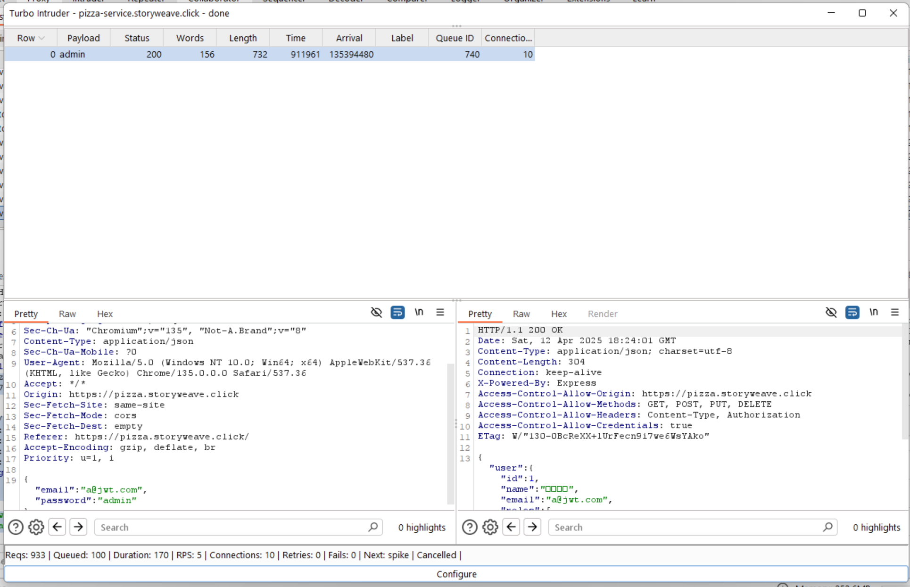
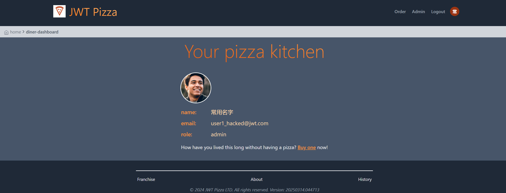
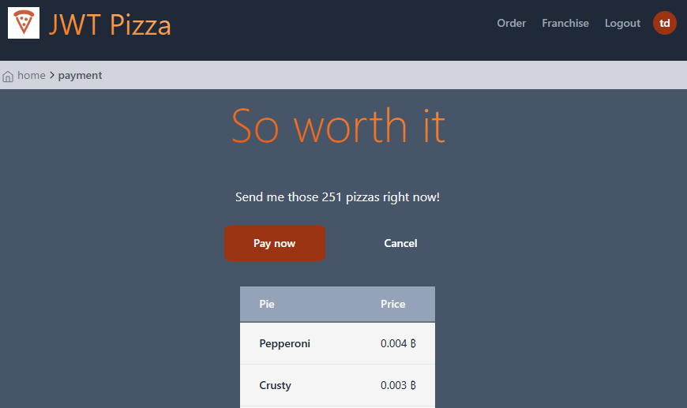
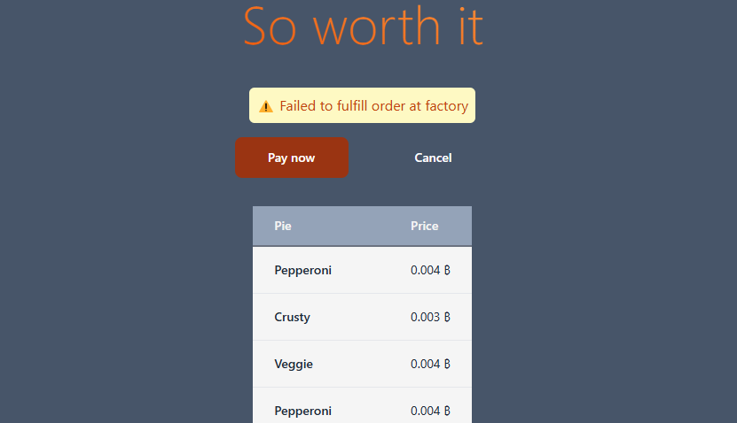

### Example attack record

| Item           | Result                                                                         |
| -------------- | ------------------------------------------------------------------------------ |
| Date           | June 18, 2053                                                                  |
| Target         | pizza.byucsstudent.click                                                       |
| Classification | Injection                                                                      |
| Severity       | 1                                                                              |
| Description    | SQL injection deleted database. All application data destroyed.                |
| Images         |    Stores and menu no longer accessible. |
| Corrections    | Sanitize user inputs.                                                          |

| Item           | Result                                                                         |
| -------------- | ------------------------------------------------------------------------------ |
| Date           | April 12, 2025                                                                 |
| Target         | pizza.storyweave.click                                                         |
| Classification | Identification and Authentication Failures                                     |
| Severity       | 3                                                                              |
| Description    | Brute forced admin password. Gained access to admin account. Used the top 10,000 most common passwords. |
| Images         |    200 Response indicates we found correct credentials. 
                      Iterated through the top 10000 passwords. |
| Corrections    | All accounts now have more secure passwords, with a combination of uppercase, lowercase, numbers, and symbols. |

| Item           | Result                                                                         |
| -------------- | ------------------------------------------------------------------------------ |
| Date           | April 12, 2025                                                                 |
| Target         | pizza.storyweave.click                                                         |
| Classification | Injection                                     |
| Severity       | 4                                                                              |
| Description    | The PUT /api/auth/:userId endpoint uses string interpolation when creatind it's DB query. This allows the user to inject SQL through the email or password fields. This can allow them to drop all the data in the DB. This, coupled with the knowledge that user IDs are just ints, allows someone to change the creditials on accounts by iterating through userIDs. |
| Images         |    This admin account was infiltrated, using the above method. Potentialy all accounts could be changed using this method, but you really only need to go until you find an admin. |
| Corrections    | The affected endpoint no longer uses string interpolation. It uses the same query() method as the other endpoints. |

| Item           | Result                                                                         |
| -------------- | ------------------------------------------------------------------------------ |
| Date           | April 12, 2025                                                                 |
| Target         | pizza.storyweave.click                                                         |
| Classification | Insecure Design                                     |
| Severity       | 1                                                                            |
| Description    | Users are able to order as many pizzas as they want. This makes it very easy to cause errors when we try to hit our factory endpoint. This could make a DOS attack easier, or at least overwhelm our logs with meaningless errors. |
| Images         |    Here the user was able to attempt an order of 251 pizzas. 
                      It resulted in this error. |
| Corrections    | The UI now only allows for up to 10 pizzas per order. Additionally, the endpoint will reject orders with more than 10 pizzas. |